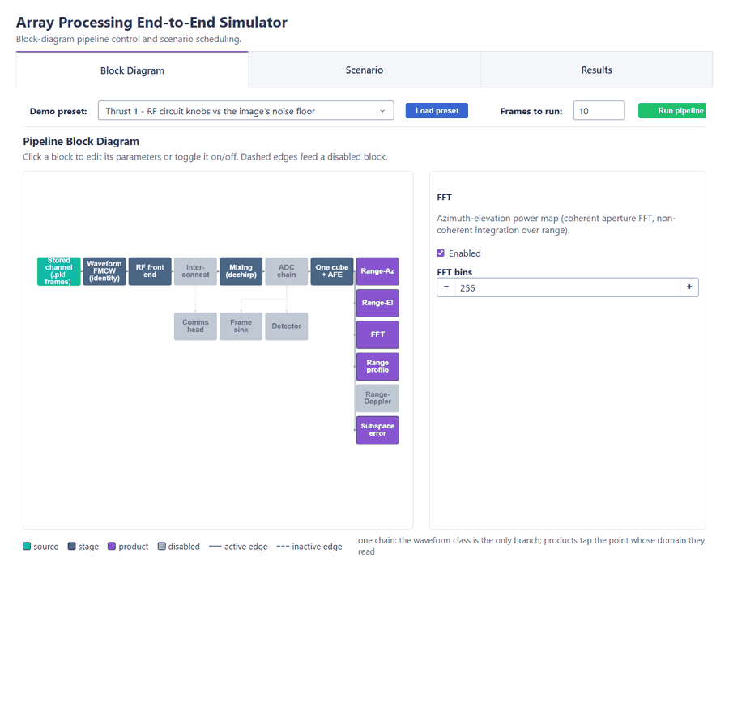
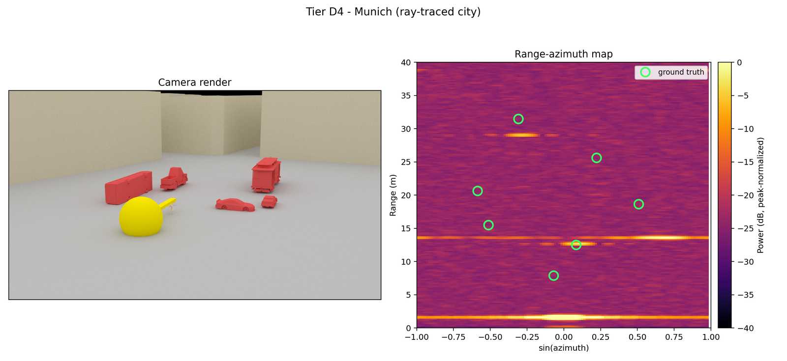
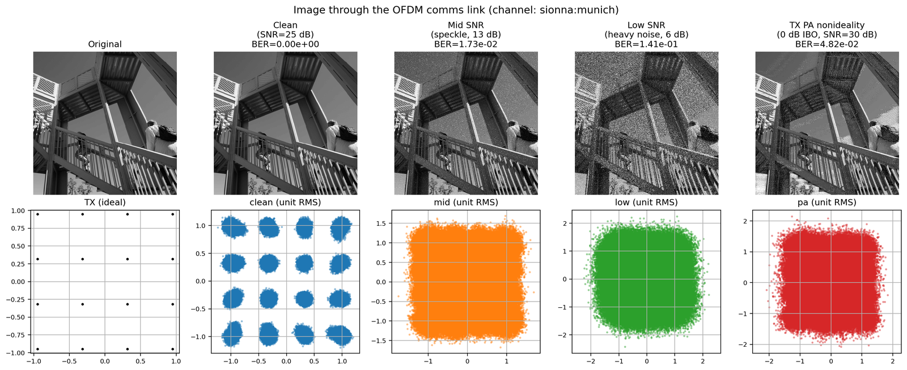
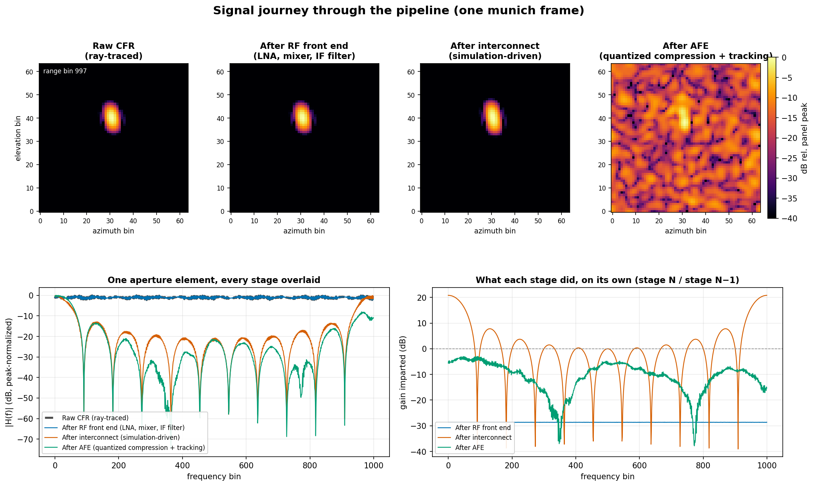
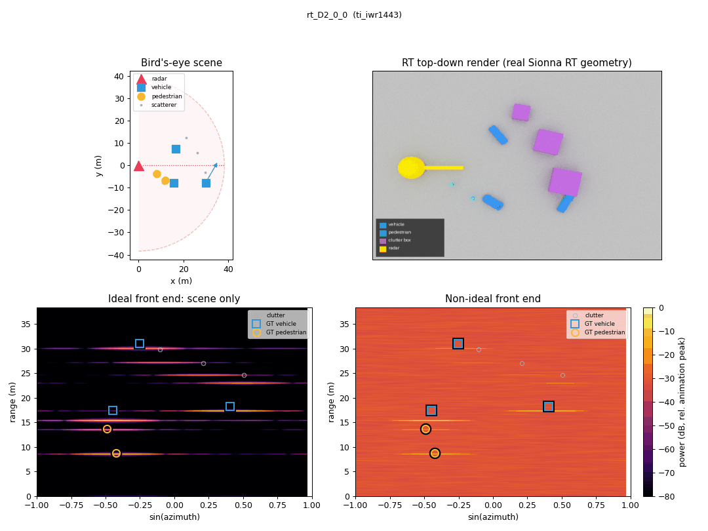
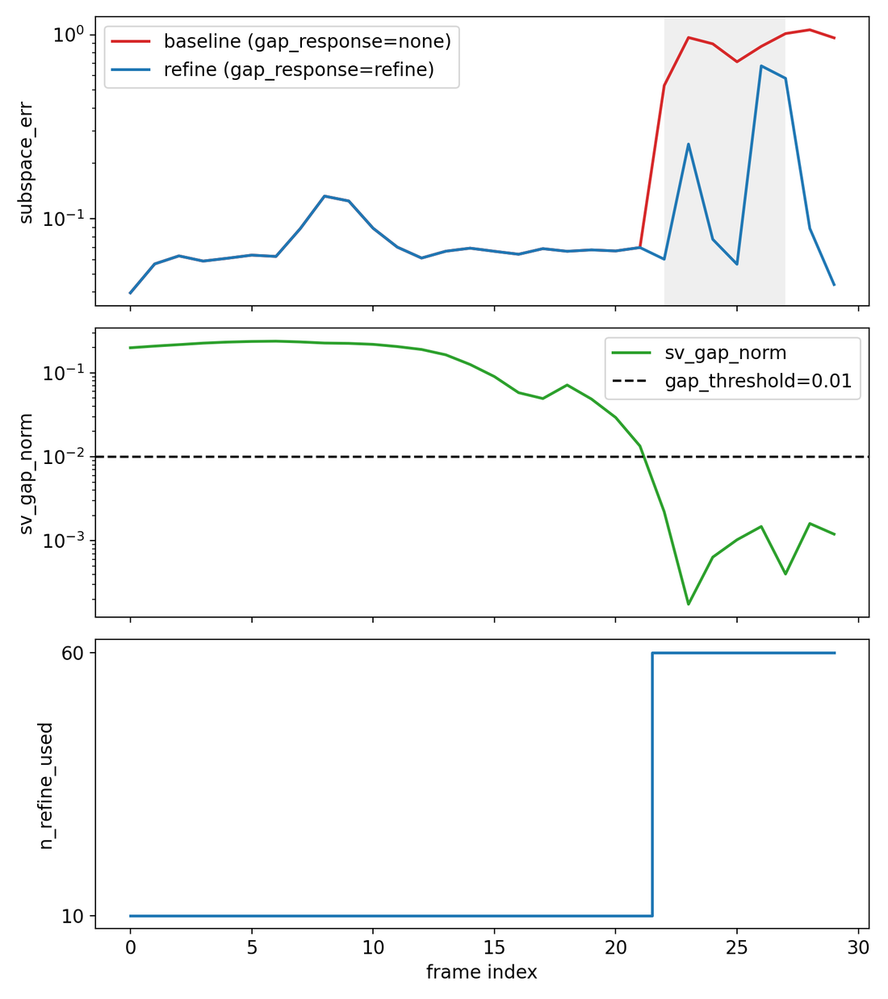
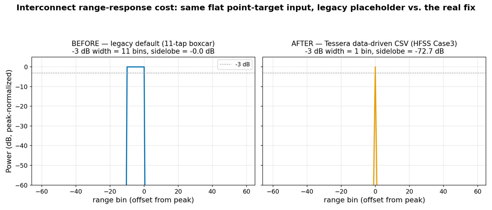
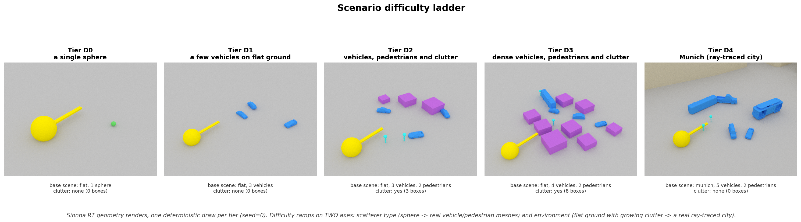
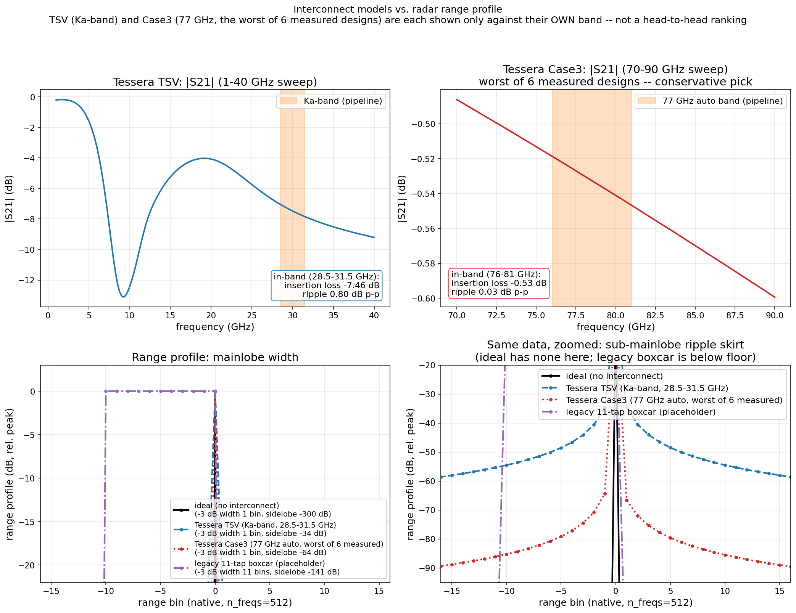
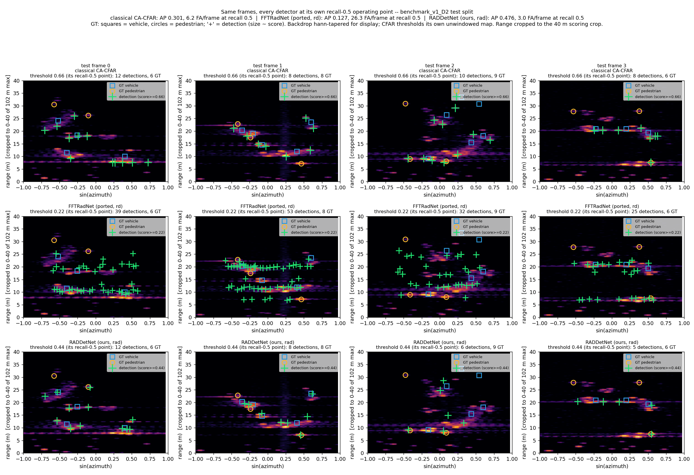

# Array Processing End-to-End Simulator

**Release v1.0**

Simulate a large antenna array **end to end**: a ray-traced RF environment
([Sionna RT](https://nvlabs.github.io/sionna/)) → analog RF front-end distortion →
a simulation-driven interconnect → adaptive feature extraction → online subspace
tracking → radar maps, target scenes, and OFDM communications. Every stage is a
swappable **block**, configurable from Python or from the browser. Every figure below
comes from this simulator. (Pointers of the form `notes/...` anywhere in this tree refer
to the maintainers' private notes repository, which is not shipped; the finding they
point at is summarised where it is used.) What a clean clone can and cannot regenerate,
stated exactly:

- The **interconnect** figures regenerate from a clean clone with no extra steps —
  `python -m e2e.main.main_interconnect`, CPU only.
- The **subspace-tracker** figure names a command, but that command consumes ray-traced
  `munich.pkl` frames, which are **gitignored and not shipped**. Generate them first (see
  [Sionna RT frame generation](#advanced-sionna-rt-frame-generation-gpu)) — that needs a
  GPU and hours. Without it the command fails immediately with `FileNotFoundError` —
  though `scenario_runner --dry-run --frames 10 --out e2e/environment/sionna_sims/munich.pkl`
  (without `--frames` the dry run writes the full-length file, ~4 GB) gives
  synthetic frames that exercise the same pipeline on a CPU (the figure still needs the
  real ones).
- The four **scene GIFs** (`scene_D0`–`scene_D3`) regenerate on a CPU from the analytic
  scene sampler — `python -m e2e.render_scene --tier D2 --config benchmark_v1 --out
  scene_D2.gif` (the tier picks the file).
- Three figures — the scene/range-azimuth pair, the signal journey, and the difficulty
  ladder — are *plotted* by scripts in the maintainers' private notes repository. The
  pipeline behind them is here; the plotting is not.
- `ui_walkthrough.gif` regenerates from the app itself — `python -m webapp.walkthrough`
  drives the web UI in a headless browser through load-preset → run → turn the knob → run
  again. Needs `pip install -e ".[dev,webapp]" && playwright install chromium`, torch, and
  the munich frames the preset replays.
- The **detection side-by-side** figure — `python -m e2e.ml.detect_side_by_side` — needs
  three things a clean clone does not have: the `b1_bench_v3` corpus, the trained
  checkpoints, and `e2e/ml/runs/beat_cfar.json` that scores them (all under gitignored
  `e2e/ml/datasets/` and `e2e/ml/runs/`; the ML section's commands produce them).
- The **image-through-the-comms-link** figure regenerates on a CPU —
  `python -m e2e.main.main_image_link` (synthetic channel when no frames are present).

<p align="center">
  
</p>
<p align="center"><em>The web UI: load a demo preset (block state, frame count and the operator's card in
one click), run real ray-traced frames through the receive chain, turn the card's knob, run again, and read
the before/after on one screen. Every run carries a banner saying what produced it.</em></p>

## Gallery

| | |
|---|---|
|  |  |
| *The scene and what the radar sees: a Sionna RT render of a Munich scene (left) and the pipeline's range-azimuth map for that same scene, with ground-truth markers (right). At the higher SNR the resolved targets appear as separate returns; at the lower one the weakest sit below the display window (off the bottom of the colour scale, not absent). The right-hand panel is an analytic point-target synthesis of the ray-traced tier-D4 scene (`e2e.ml.rd_synth`, `radial_like` preset), not a `munich.pkl` run; the figure's generator lives in the maintainers' private notes repo, so it has no in-repo regenerate command.* | *Seeing is believing for comms too: a photo's bits through the OFDM link on one spatial channel of the munich channel response (SISO by design; array combining lives in `ModemBlock`) — clean, noisy, and with TX power-amplifier distortion. Regenerate with `python -m e2e.main.main_image_link`.* |
|  |  |
| *One ray-traced frame's journey through the chain: raw channel response → RF front end → interconnect (the 11-tap placeholder boxcar, not a simulated design — its nulls are what the lower panels show) → adaptive compression → azimuth-elevation map. Every stage shown is in this tree; the script that assembles them into this panel is in the maintainers' private notes repo, so this figure has no in-repo regenerate command.* | *Scenes move: vehicles and pedestrians crossing the field of view, seen by an ideal front end (scene content only) and by the non-ideal front end.* |
|  |  |
| *Rank degeneracy costs tracking accuracy at every fixed effort. Measured over 69 munich frames: median error rises ×2.3–2.4 at one refinement pass per frame; at sixty passes the median rises only ×1.8 but 7–8 of 25 collapsed frames blow out (worst ×17–19; the mean is ×4.6, and the mean alone misreads as a uniform degradation), and the true subspace rotates 2.9× more per frame while the gap is collapsed. The ranges are the spread between the committed run (2026-08-18) and a regeneration at HEAD (2026-09-23): the tracker is nondeterministic and the blow-out tail moves by one frame between runs, so the figure is one run and its header numbers are that run's — the target goes both lower-rank and faster-moving. Three arms, so the trade is visible rather than implied. The gate matches the 60-pass arm's accuracy inside the collapse — and inside the collapse it is also spending 60 passes, so it buys that accuracy with the same compute, not less. What it saves is averaged over the whole run: a mean 22.4 passes/frame against a constant 60 — the gate uses about 37% of the constant-effort compute, a 63% saving — earned outside the collapse where it idles at one pass and its error is ~15x worse than constant effort. It is a compute-saving heuristic that spends where a diagnostic tells it to, not a free accuracy win. Two disclosures the figure itself carries: the frame ORDER is constructed, not observed (clean frames forward into the collapse, then the same frames reversed as the recovery — the tracker's response is real, the sequence is not), and the gate's trigger, `sv_gap_norm`, is simulator instrumentation a deployed receiver could not measure. Regenerate with `python -m e2e.main.main_subspace_refine --frame-order collapse-window`.* | *Hardware realism is data-driven: all six of the collaborators' simulated 77 GHz designs plus the Ka-band TSV, at native resolution. The legacy placeholder smears a target across 11 range bins; every simulated arm stays at one. They separate only in the skirt (lower panel), and they order there exactly as their in-band ripple does — which is how we can now SEE, rather than take on trust, that Case3 is the most demanding of the six FOR THIS PIPELINE — highest in-band loss and ripple across 75–81 GHz (from the CSVs; the regenerate command evaluates 76–81 GHz and prints the same −0.53 dB / 0.03 dB), at −0.53 dB median loss and 0.034 dB peak-to-peak ripple against −0.25 to −0.29 dB and ≤0.009 dB for the rest (measured from the shipped CSVs at HEAD; an earlier caption quoted the 70–90 GHz full-sweep ripple, 0.113 dB, as if it were in-band). That is a ranking by what OUR range response is sensitive to, not a verdict on the designs, which were not drawn for this band or this use. TSV is a different, non-overlapping band and is not ranked against them. Regenerate with `python -m e2e.main.main_interconnect`.* |


*Scenario generation spans a difficulty ladder — from a few vehicles on flat ground (D1) to a full ray-traced city (D4). (Panel assembled by a private plotting script; the scenes themselves regenerate from `e2e/environment/rt_scenes.py`.) Two ladders exist and they are not the same: the RAY-TRACED tiers (`e2e/environment/rt_scenes.py`, used by `e2e.ml.chain_generate`) run D0–D4; the ANALYTIC tiers (`e2e/ml/scenes.py`, used by `e2e.ml.dataset`) run D0–D3.*

## Getting Started

### Installation

The project uses a standard `pyproject.toml` (setuptools). Install the package plus
its optional extras as needed:

```bash
pip install -e .                  # core runtime (torch, numpy, matplotlib, tqdm, Pillow)
pip install -e ".[webapp]"        # + the Dash/Plotly web UI
pip install -e ".[sionna]"        # + Sionna RT / DrJit / Mitsuba (real frame generation; needs a GPU/LLVM)
pip install -e ".[dev]"           # + the test suite
```

The pinned `requirements.txt` / `requirements-dev.txt` files are still provided for
reproducible environments if you prefer `pip install -r`.

Prefer a guided, copy-pasteable path over reading prose? [`docs/FIRST_SCENARIO.md`](docs/FIRST_SCENARIO.md)
walks clone -> install -> dry-run scenario -> pipeline run -> web UI -> a block swap, entirely on CPU.

### Usage

#### Quickstart (no GPU required)

Everything below runs on a plain CPU machine with only the core install — no Sionna,
no GPU, no precomputed frames.

**1. Dry-run a scenario.** The scenario runner has a `--dry-run` mode that exercises
all scheduling / motion / serialization logic and emits *synthetic* frames, so it
needs neither Sionna nor a GPU:

```bash
python -m e2e.environment.scenario_runner --scenario munich_radar --dry-run --frames 5 \
    --out scratch/munich_radar_dryrun.pkl     # the full 100-frame scenario is 3.9 GB
```

Pass `--out`: without it the runner writes to the scenario's default path under
`e2e/environment/sionna_sims/`, replacing any real ray-traced frames you have there
with synthetic ones. (The runner now refuses that specific case rather than doing it
silently.)

**2. Run the communications / ISAC examples.** Each example saves figures to
`e2e/main/figures/` and **falls back to a synthetic channel when frames are absent**,
so they work out of the box on CPU:

```bash
python -m e2e.main.main_comms_link            # OFDM link, BER vs SNR + constellation
python -m e2e.main.main_channel_estimation    # pilot-based estimation, MSE vs SNR
python -m e2e.main.main_isac                  # joint radar+comm in one multi-node scene
python -m e2e.main.main_comms_head            # SAME pipeline, swappable radar/comms heads
python -m e2e.main.main_tx_nonideality        # ideal vs non-ideal TX: EVM, ACPR, sensing cost
```

**3. Launch the web UI** (block diagram + scenario editor) — see
[Web UI](#web-ui-block-diagram--scenario-scheduling) below. The shell and scenario
editor build without torch/Sionna.

> **Note: frame `.pkl` files are not shipped.** The runtime radar pipeline
> (`python -m e2e.main.main_sionna_blocks`) consumes precomputed Sionna RT
> S-parameter frames (`.pkl` files under `e2e/environment/sionna_sims/`). Those files
> are **gitignored and not included in the repository** — you must generate them
> first (see [Advanced: Sionna RT frame generation](#advanced-sionna-rt-frame-generation-gpu)).

#### Advanced: Sionna RT frame generation (GPU)

To run the full radar pipeline you first generate real S-parameter frames with Sionna
RT ray tracing. This needs `pip install -e ".[sionna]"`, an LLVM toolchain, and (for
OptiX) a CUDA-12.x NVIDIA driver — see the [GPU / driver / LLVM](#gpu--driver--llvm)
section for the exact requirements.

```bash
# Generate the default Munich radar frames (writes munich.pkl) -- this is the file
# main_sionna_blocks.py below reads (its SionnaEnvironmentBlock('munich') call is
# hardcoded to that filename).
python -m e2e.environment.sionna_simple_channel

# Then run the runtime radar pipeline against the generated frames.
python -m e2e.main.main_sionna_blocks
```

Real ray-traced generation is also available through the scenario runner, which writes
its own `<scenario_name>.pkl` under `e2e/environment/sionna_sims/` (e.g. `munich_radar.pkl`
for the `munich_radar` scenario below) -- this is a **different file** from `munich.pkl`
above, so it is *not* picked up by `main_sionna_blocks` (hardcoded to the `'munich'`
scenario name). Consume it via `SionnaIterator` directly (path from
`e2e.environment.scenario_runner.default_out_path("munich_radar")`) or through the web
UI's Scenario tab:

```bash
python -m e2e.environment.scenario_runner --scenario munich_radar --frames 10
```

### GPU / driver / LLVM

**LLVM (CPU backend for DrJit).** DrJit needs an LLVM shared library on the CPU path.
Install it with conda/mamba and point `DRJIT_LIBLLVM_PATH` at the library — the file
extension differs per OS:

```bash
# macOS (libLLVM*.dylib)
export DRJIT_LIBLLVM_PATH=$(find "$CONDA_PREFIX/lib" -name 'libLLVM*.dylib' 2>/dev/null | head -1)

# Linux (libLLVM*.so)
export DRJIT_LIBLLVM_PATH=$(find "$CONDA_PREFIX/lib" -name 'libLLVM*.so*' 2>/dev/null | head -1)
```

```powershell
# Windows PowerShell (LLVM-C.dll, usually under <CONDA_PREFIX>\Library\bin)
$env:DRJIT_LIBLLVM_PATH = (Get-ChildItem "$env:CONDA_PREFIX\Library\bin" -Filter 'LLVM-C.dll' | Select-Object -First 1).FullName
```

Verify with `python -c "import drjit; print('DrJit loaded successfully!')"`.

**NVIDIA driver / CUDA (GPU OptiX backend).** The pinned stack (Sionna 1.2.2 /
DrJit 1.3.1 / Mitsuba 3.8.0) works on both current driver families:

* **Validated:** driver `576.80` / CUDA `12.9`, and driver `610` / CUDA `13.3`.
* **History, so you don't rediscover it:** the previously pinned DrJit `1.2` /
  Mitsuba `3.7` stack fails on driver `610` / CUDA `13.3` with a `ptx2llvm` error
  (`Failed to translate PTX input to LLVM`). The fix is **upgrading the Python
  packages** (to the pins in `requirements.txt`), not downgrading the driver.

CPU-only generation (`--dry-run`, or the synthetic-channel example fallbacks) does not
need any NVIDIA driver.

## Web UI (block diagram + scenario scheduling)

A browser-based interface for building pipelines and scenarios visually:

```bash
python -m webapp.app      # serves at http://127.0.0.1:8050
```

It has three tabs:

- **Block Diagram** — a drag/connect node graph of the pipeline blocks (environment →
  RFFE → interconnect → AFE → subspace → FFT / range-az / range-el / subspace-error).
  Toggle blocks on/off, edit their parameters, and run the pipeline to view results.
  A **demo preset** dropdown loads a complete configuration in one click — every block's
  state, the frame count, and an operator's card saying what to show, which knob to turn
  and what not to claim (`webapp/demo_presets.py`); loading one opens the editor on that
  knob. Two alternative sources sit beside the precomputed frames: live ray tracing of a
  Scenario, and replay of a stored benchmark corpus into a radar-cube + detector chain
  (CFAR or a trained checkpoint).
- **Scenario** — place and edit antenna nodes (radar / comm TX / comm RX) and objects on
  a 2D map, set the base scene, frequency plan, and frame count, then validate, save/load,
  or **generate frames** for the scenario.
- **Results** — the product figures of the last run under a banner saying what produced
  them (run number, time, source, frames run, detector operating point), with the
  previous run of the same preset kept underneath for before/after.

The UI shell and scenario editor run without `torch`/Sionna; only *running* a pipeline
needs precomputed frames + `torch`.

## Scenario scheduling and generation

Scenarios are declarative, JSON-serializable specs (`e2e/scenario.py`): a base scene, a
set of antenna nodes with roles and motion, scene objects, and a frequency plan.
`e2e/environment/scenario_runner.py` turns a scenario into S-parameter frames via Sionna
RT ray tracing. A **dry-run** mode exercises all scheduling/motion/serialization logic
and emits synthetic frames without needing Sionna installed:

```bash
# Reference scenarios: munich_radar, munich_isac, etoile_radar, munich_patrol
python -m e2e.environment.scenario_runner --scenario munich_radar --dry-run
python -m e2e.environment.scenario_runner --scenario path/to/scenario.json --frames 10

# Drop --dry-run on a machine with Sionna RT + DrJit + LLVM to generate real frames.

# The etoile_radar scenario can back the runtime 'etoile' base scene directly.
# NOTE: no --dry-run below means this is a REAL ray-tracing run -- it needs Sionna RT
# + DrJit + LLVM and a GPU, and etoile_radar is 100 frames x 5000 frequencies, so it
# is a long job. Add --dry-run (and a scratch --out) first if you only want to see the
# shapes and the file it would write.
python -m e2e.environment.scenario_runner --scenario etoile_radar \
    --out e2e/environment/sionna_sims/etoile.pkl
```

A **scenario pack** of preconfigured variations ships as JSON under
`e2e/environment/scenarios/` (dense traffic, a two-receiver ISAC scene, a street-canyon
radar, ...). Each is a ready-made `--scenario <path>` input and a template for your own:
copy one, edit, validate, generate.

### Physical signal levels

Setting `tx_power_dbm` on a transmitting node (`radar` / `comm_tx`) makes generation emit
**physically scaled S-parameters** (volts at the receiver): the real path requests Sionna's
un-normalized CFR (which carries free-space path loss, antenna patterns, and multipath),
the dry-run mock applies an analytic free-space level, and both are scaled to absolute
voltage via the configured transmit power and the 50 Ω system impedance. The reference
scenarios default to 12 dBm (IWR1443-class). Leaving `tx_power_dbm` unset (`None`) keeps
the legacy unit-energy convention. **The convention is per-link** (it follows each link's
TX node) — and generated frames are now **self-describing**: the `.pkl` carries a `meta`
block (frequency plan, per-link array geometry, `tx_power_dbm`, scale convention) that
`SionnaIterator` exposes and consumers read automatically — the environment block derives
its array shape from it, and the web UI's RFFE "auto" scale mode follows it. Legacy pkls
(bare arrays) still load; for those, consumers set `physical_scale` manually. On the
consumption side, `RFFEBlock(physical_scale=True)`
feeds those volts directly into the analog front-end — whose clamp, compression, and
thermal-noise floor are then a real operating point rather than an arbitrary
normalization — while the default (`physical_scale=False`) preserves the legacy
`signal_scaling` normalization for old frame sets.

> **Two scenario namespaces (different stages).** Do not confuse them:
> * **Runtime / precomputed-frame selection** — `munich`, `etoile`. These name a
>   *base scene* whose precomputed `.pkl` frames the runtime pipeline and the
>   `SionnaIterator` load (e.g. `base_scene="munich"`).
> * **Generation reference scenarios** — `munich_radar`, `munich_isac`. These are the
>   declarative `REFERENCE_SCENARIOS` entries in `e2e/scenario.py` that the *generator*
>   (`scenario_runner`) turns into frames. They build on top of a base scene.
>
> In short: `munich_radar`/`munich_isac` are generation inputs; `munich`/`etoile` are
> the runtime base scenes whose frames get consumed.

**Multi-link / ISAC scenarios.** A scenario with several simultaneous links — e.g. a
monostatic radar *and* a comm TX→RX link (`munich_isac`) — exports one frame-stack per
link. Single-link scenarios dump a plain array (as before); multi-link scenarios dump a
`dict` of `link_name -> frames`. Each link is generated in its own Sionna scene, so links
with different array sizes (a 32×32 radar RX and a 4×4 comm RX) coexist. Select a link
when loading:

```python
from e2e.environment.sionna_iterator import SionnaIterator
it = SionnaIterator("e2e/environment/sionna_sims/munich_isac.pkl",
                    link="building_comm_tx__car_comm_rx")   # path relative to the repo root
```

### Physical modeling scope & limitations

Honesty contract for this release: what's physically modeled, and what's a placeholder
or a link-level abstraction. For the full per-stage real-world-effect -> model ->
approximations -> evidence breakdown, see [`docs/PHYSICS.md`](docs/PHYSICS.md).

- **Diffuse reflection is off in the legacy generator only.** `sionna_simple_channel.py`,
  which produced `munich.pkl`, runs specular/LOS/refraction paths only (`max_depth=5`).
  The scenario runner and the RT environment block behind the ML corpora solve with
  `diffuse_reflection=True` (`max_depth=2`); the ground is silent there because
  `DEFAULT_GROUND_SCATTERING_COEFFICIENT = 0.0`, not because diffuse is off. Details in
  [`docs/PHYSICS.md`](docs/PHYSICS.md).
- **The composed link budget's noise floor is not yet physical.** In the RFFE +
  link-budget chain the floor moves with transmit power (+20.8 dB for 0 → 24 dBm on a
  zeroed channel, where it should not move) and `noise_figure_db` is effectively inert
  (−0.06 dB for 5 → 25 dB, where it should add 20 dB). The absolute-scale statement under
  "Physical signal levels" holds for the RFFE's own 4kTR floor; the composition is pinned
  by two `xfail` tests in `tests/test_ml_link_budget.py` and is an open maintainer item.
- **Comms SNR is enforced post-hoc at the receiver.** Noise is added to hit a target SNR
  directly, decoupled from the ray-traced path loss; the radar leg of the same scenarios
  *does* use the physical channel gain from the ray-traced/analytic path. The **pipeline
  comms head** (`ModemBlock`, see "Swappable heads" above) does perform real spatial
  combining across the array (`combining="mrc"`/`"subspace"`, with independent
  per-element noise injected before combining so the resulting array gain is honest) —
  it is only the per-element/per-combined-stream SNR target itself that is set post-hoc,
  not the combining. The standalone link-level examples (`main_comms_link`,
  `main_isac`, `main_isac_multilink`) remain single-spatial-channel (SISO) by design —
  they demonstrate the OFDM/channel-estimation machinery in isolation, not the array.
- **The OFDM path applies the channel as a per-subcarrier frequency-domain multiply**,
  not a time-domain convolution, so ISI/CP-overrun effects cannot occur in the shipped
  examples. `cp_len` is exercised only by the modem's own time-domain round-trip
  (`OFDMModem.modulate`/`demodulate`), not by any end-to-end example.
- **"S-parameters" are absolute voltages in physical-scale mode.** The stored per-link
  quantities are called `s_pars` throughout the code, but when generated with
  `tx_power_dbm` set they are receiver voltages (V_rms across 50 ohms), not the
  dimensionless network-theory S21 ratios the name suggests. The legacy (`tx_power_dbm
  = None`) convention is unit-energy, also not literal S21.
- **Frames are independent scene snapshots** with no frame-to-frame phase continuity, so
  Doppler processing across frames (as opposed to within a single frame/chirp) is not
  physically meaningful.
- **`InterconnectBlock` still defaults to a placeholder**: a fixed 11-tap boxcar
  frequency response, independent of the scenario's `FrequencyPlan`. Measurement-driven
  transfer functions are available and shipped (see below) but are opt-in.

### Interconnect: placeholder vs. simulated

Pass `transfer_csv=` to `InterconnectBlock` and the interconnect stops being a stand-in:
the block loads a simulated |S21|(f) and resamples it onto the scenario's band. Seven
derived datasets ship in `e2e/data/interconnect/` — a Ka-band TSV plus all six 77 GHz
automotive designs — every one of them from HFSS/surrogate S-parameter simulation.
The figure below deliberately plots only Case3 of the six, so the comparison stays
readable; `main_interconnect` draws all six in its own figure.

The interconnects were simulated by **Mohamed Gharib and Prof. Inna Partin-Vaisband
(University of Illinois Chicago)**. What ships here is their simulation output; the
simulation code is not distributed with this repository and is available on request to
those authors. See `e2e/data/interconnect/README.md` for per-dataset provenance.

```bash
python -m e2e.main.main_interconnect     # writes the two README figures (gallery + below) and a
                                         # transfer-function figure under e2e/main/figures/
```



*What a real interconnect costs you.* Top row: the two simulated transfer functions, each
against its own band. Bottom left: all four range profiles at native resolution — every
data-driven arm keeps a 1-bin mainlobe, while the legacy boxcar smears it to 11 bins.
Bottom right: the same data with the y-axis stretched over the sidelobe skirt, where the
differences actually live. In-band ripple sets the skirt height, exactly as it should:
0.80 dB p-p of ripple gives a −34.5 dB sidelobe, 0.03 dB gives −64.4 dB.

Two honesty notes, because this figure is easy to over-read. The two models sit in
**different bands** (Ka-band and 77 GHz automotive), so this is not a head-to-head ranking
of designs. And the 77 GHz case shown is deliberately the **most demanding for this pipeline** of the six simulated
designs — it is a conservative bound, not a typical part. Sidelobe numbers are measured at
**native resolution**: zero-padding the transform contributes sidelobes of its own and
would swamp the effect being shown.

## Communications and joint radar/comms (ISAC) examples

Beyond the radar pipeline, the `e2e/comms/` package adds an OFDM modem, channel
estimation/equalization, and ISAC utilities. Example scripts (each saves figures to
`e2e/main/figures/`, and falls back to a synthetic channel when frames are absent):

```bash
python -m e2e.main.main_comms_link            # OFDM link, BER vs SNR + constellation
python -m e2e.main.main_channel_estimation    # pilot-based estimation, MSE vs SNR
python -m e2e.main.main_isac                  # joint radar+comm in one multi-node scene
python -m e2e.main.main_isac_multilink        # consume a multi-link .pkl: radar + comm legs per link
python -m e2e.main.main_tx_nonideality        # ideal vs non-ideal TX: EVM, ACPR, sensing cost
```

`main_isac_multilink` is the end-to-end demo of the **multi-link export**: it generates
(or reuses) one `.pkl` holding both links of `munich_isac`, discovers them with
`SionnaIterator.available_links()`, and drives the radar and comm legs off their own
frame stacks. With dry-run frames the numbers are plumbing checks; drop a real
Sionna-generated `.pkl` at the same path and both legs become physical with no code
changes.

The comms blocks are also **first-class pipeline stages**: add `ModemBlock` and `BERBlock`
to a `Simulation`'s `downstream_blocks` and they run alongside the radar products (FFT,
range-az/el, subspace error), consuming the same `s_pars` channel. Downstream blocks
compose — `ModemBlock`'s transmitted/received bits flow to `BERBlock` in the same step.

### Swappable heads: radar products or a comms link, off the same pipeline

The receive chain (environment → RFFE → interconnect → AFE → AdaOja subspace tracking)
ends in a reconstructed aperture grid; everything past that point is a swappable **head**.
`RangeAzBlock`/`RangeElBlock`/`FFTBlock` turn it into a radar product; `ModemBlock` +
`BERBlock` turn the SAME reconstruction into an OFDM communications link. `ModemBlock`'s
`combining` selects how the comms head uses the array:

- `"element0"` — the historical single-tap SISO shortcut (one spatial channel, no
  combining).
- `"mrc"` — full-aperture maximum-ratio combining: independent per-element noise is
  injected *before* combining (`e2e/comms/beamforming.py`), so the measured array gain
  (~`10*log10(N)` for `N` elements at high correlation) is real coherent-combining gain,
  not a noise-averaging artifact.
- `"subspace"` — reuses the AdaOja tracker's dominant tracked direction (`state['U'][:, 0]`)
  as a broadband beamformer weight instead of a fresh MRC solve, so the same online-tracked
  subspace serves both heads.

`python -m e2e.main.main_comms_head` runs the full pipeline three times (fresh
`Simulation` per run, same frames) — once per `combining` mode — and reports mean
BER/EVM/array-gain plus a radar-product map from the same run, to make the "one
pipeline, two heads" point concrete. The web UI exposes the same head as an optional
"Comms Head (OFDM)" block downstream of the subspace stage.

## Machine learning: FMCW radar dataset + perception models

`e2e/ml/` builds labeled FMCW MIMO radar training data (range-Doppler tensors +
FFTRadNet-style detection labels) and ships two ported detection models plus the repo-native `RADDetNet` (`FFTRadNet` from
valeoai/RADIal, `SSMRadNet` from AnuvabSen1/SSMRadNet) plus a reference train/eval CLI.

**There are two generators, and they are not interchangeable.** Reach for the right one:

```bash
# A. Plumbing check — analytic, CPU-only, no Sionna. Fast, and NOT a benchmark corpus.
python -m e2e.ml.dataset --config ti_iwr1443 --tier D1 --n 200 --seed 0
python -m e2e.ml.train --manifest e2e/ml/datasets/ti_iwr1443_D1/manifest.json \
    --model fftradnet --epochs 25
```

`ti_iwr1443` has 12 virtual elements, so its Rayleigh azimuth resolution is coarser than
the evaluation's own match tolerance by about 2.8×: a perfect detector, localising to the
diffraction limit, still scores as a miss. That path exercises the code, not the science.

```bash
# B. The benchmark corpus — real Sionna RT, GPU, ~10 s/scene. This is what the table
#    below is measured on. See "GPU / driver / LLVM" for the toolchain it needs.
python -m e2e.ml.chain_generate --config benchmark_v1 --tier D2 --n 1700 --seed 20260829 \
    --no-local-assets --out e2e/ml/datasets/b1_bench_v3     # the corpus the table is scored on

M=e2e/ml/datasets/b1_bench_v3/benchmark_v1_D2/manifest.json
python -m e2e.ml.train --manifest $M --model fftradnet --epochs 30 --seed 0 \
    --out e2e/ml/runs/b5_fftradnet_v3
python -m e2e.ml.train --manifest $M --model ssmradnet --epochs 120 --batch-size 2 \
    --accum-steps 4 --seed 0 --out e2e/ml/runs/b5_ssmradnet_v3
python -m e2e.ml.train --manifest $M --model raddetnet --input-format rad --epochs 40 \
    --batch-size 8 --seed 42 --deterministic --out e2e/ml/runs/b7_raddetnet   # the table's lead arm
```

`e2e/ml/datasets/` and `e2e/ml/runs/` are gitignored: a clean clone has neither the corpus
nor the checkpoints. Every number in the detection table below was produced from them by
the commands shown; the bootstrap interval, the out-of-distribution and joint-corpus
paragraph, and the control statistics name their own artifact and command where they
appear. `b1_bench_v2` (the earlier corpus used for the distribution-shift test) has no
documented regeneration recipe: it is a salvaged partial run of the previous generator
and exists only on the machines it was generated on.

`benchmark_v1` (4×16 = 64 virtual elements, v_max 9.69 m/s) is the preset the benchmark
was measured on, and is valid on both axes at once (`ddma_wide_v1`, 4×48 = 192 virtual at
the same v_max, is also valid; no published result uses it) — azimuth resolvable within the match tolerance AND targets
that do not alias in Doppler. `--no-local-assets` restricts scene meshes to the
licence-cleared pool. Run `e2e.ml.baseline.resolution_report` before trusting an AP on any
preset you have changed.

> **Known bug:** generation hangs somewhere around scene ~1720, holding a GPU at 100%
> without writing further frames. Both of our corpora stopped there. Ask for `--n 1700`,
> or watch the output directory and kill the job when the frame count stops advancing —
> then recover the manifest, which is only written after the final scene, with
> `python -m e2e.ml.rebuild_manifest --corpus <dir> --config benchmark_v1 --tier D2
> --seed <yours> --write`. The frames themselves are fine.

See [`e2e/ml/README.md`](e2e/ml/README.md) for the difficulty-tier/preset tables, data
format, smoke-test results, and model attribution/licensing notes, and
[`e2e/ml/DATA_FORMAT.md`](e2e/ml/DATA_FORMAT.md) to decode a corpus with numpy alone.

### The detection benchmark measures its own chance floor

`e2e.ml.compare_detectors` scores every arm at **matched recall** and includes by default
(`--no-null` omits it) a **data-blind null arm** — a detector that places boxes at random inside the region where
training-set targets live, seeing no input at all. That arm is the benchmark's chance
floor: measured on the same frames and the same metric, rather than assumed to be zero.

Measured on the **172-frame test split** (1,026 labelled targets) of the `benchmark_v1`
tier-D2 ray-traced corpus `b1_bench_v3`, recall 0.5, decode floor 0.01, scored within
40 m. Every number in this table is read from one file, `e2e/ml/runs/beat_cfar.json`,
written by `python -m e2e.ml.beat_cfar` (seed 42, deterministic kernels; the file lives
under the gitignored `e2e/ml/runs/`, so regenerate it with the commands below or ask the
maintainers for it):

| arm | average precision | false alarms / frame at recall 0.5 | max recall | × chance |
|---|---|---|---|---|
| **RADDetNet** (ours: Doppler as channels, range × azimuth spatial, beamformed input) | **0.476** | **3.0** | 0.978 | 5.9× |
| classical CA-CFAR | 0.301 | 6.2 | 0.888 | 3.7× |
| FFTRadNet (ported, range-Doppler input) | 0.127 | 26.3 | 0.977 | 1.6× |
| SSMRadNet (ported, range-Doppler input) | 0.123 | 27.5 | 0.989 | 1.5× |
| **data-blind null (chance floor)** | **0.081** | 33.2 | 1.000 | 1.0× |

RADDetNet's row is the seed-42 checkpoint; a seed-43 replicate of the same recipe scores
0.436 AP at 3.6 false alarms per frame in distribution — both far above CFAR, with a
seed-to-seed spread of 0.040.


*The table, drawn: the same four test frames through three detectors, each at the objectness
threshold where it first reaches recall 0.5 (0.66 / 0.22 / 0.44, from the same JSON), so the
crosses are the false-alarm comparison the table quotes. FFTRadNet's row is the diagnosis
below made visible — a stripe of detections at every true range, across azimuth. Regenerate
with `python -m e2e.ml.detect_side_by_side`.*

The null arm is *random*, so a single draw is not a constant: over seeds 0/1000/2000/3000/4000
it scores 0.0815, 0.0820, 0.0837, 0.0781, 0.0915 — mean 0.083, sd 0.005. The table reports
the seed-0 draw, because that is the one every other arm was scored against; the ratios in
the last column carry that much floor noise and should not be read to two digits.

```bash
# Rescore every arm from the checkpoints (gitignored: train them first, or ask the maintainers).
python -m e2e.ml.beat_cfar --skip-train
# The same protocol on one manifest, any mix of checkpoints:
python -m e2e.ml.compare_detectors \
  --manifest e2e/ml/datasets/b1_bench_v3/benchmark_v1_D2/manifest.json --split test \
  --classical --recall 0.5 --decode-threshold 0.01 --max-range-m 40 \
  --checkpoint raddetnet=e2e/ml/runs/b7_raddetnet/best.pt
# The null arm's seed spread:
python -c "from e2e.ml.compare_detectors import score_null; \
print([round(score_null('e2e/ml/datasets/b1_bench_v3/benchmark_v1_D2/manifest.json', \
'test', seed=s, decode_threshold=0.01, max_range_m=40.0)['AP'], 4) for s in (0,1000,2000,3000,4000)])"
```

**Why the two ported networks lose to a CFAR threshold** — measured, not argued. Their
objectness maps are near-separable `f(range)·g(azimuth)`: rank-1 energy fraction **0.89**
(FFTRadNet) / **0.76** (SSMRadNet) against **0.31** for ground truth, i.e. a stripe across
the whole field of view at every true range instead of a peak. Under azimuth-only matching
they score no better than a constant map carrying no frame information, and pairing their
predictions with a *deranged* frame's labels retains ~50% of their AP, against 10.5% for
CFAR (the F83 reference measurement, recorded as a constant in `e2e/ml/controls.py`; the
learned-detector retentions are recomputed by `python -m e2e.ml.controls`). Azimuth reaches these networks only as virtual-channel phase, and neither head
converts it into an angle bin: **range is learned, azimuth is a memorised prior.** The
corpus is sound — its own ground-truth label maps score AP 1.000 through the same scorer.
(`e2e.ml.controls` runs these three controls on any checkpoint.)

**What fixes it is the architecture, not the input.** Feeding the same beamformed
range-azimuth-Doppler cube CFAR uses into the ported decoder is worth +0.011. Making range ×
azimuth the spatial plane and Doppler the channel axis (`RADDetNet`, `e2e/ml/models/`)
scores 0.476 and passes the controls the ported networks fail (deranged-label retention
12%, azimuth-only 0.66 against 0.47 for the strongest frame-independent prior). The
defensible sentence is the narrow one: *a learned head on the classical front end beats a
CFAR threshold on the same cube, in-distribution.* An independent re-scoring reproduced
it bit-identically; the paired scene-level bootstrap gives +0.175 AP, 95% CI [+0.145, +0.208]
(`e2e/ml/runs/raddetnet_ci.json`, regenerated by `python -m e2e.ml.bootstrap_ci --compare
e2e/ml/runs/beat_cfar.json --baseline "classical CFAR" --n-boot 2000 --seed 0 --alpha 0.05
--out e2e/ml/runs/raddetnet_ci.json`; an earlier edition quoted +0.206 from a verifier's
own re-score with no artifact in the tree).

**Out of distribution it does not reliably beat CFAR.** On the test split of an earlier
corpus (`b1_bench_v2`: 173 unseen scenes, same radar, an earlier generator with a
different impairment model) CFAR scores 0.179 at 13.2 false alarms per frame; RADDetNet
0.208 at 15.1 (the checkpoint above) and 0.153 at 20.7 (a second seed) — the two seeds
straddle CFAR and both are worse at matched recall, while the ported FFTRadNet collapses
to 0.063, below that corpus's 0.065 chance floor. Trained on the train splits of BOTH
corpora, one checkpoint beats CFAR on the held-out scenes of both (0.584 at 1.4 false
alarms per frame on `b1_bench_v3` test, 0.487 at 2.9 on `b1_bench_v2` test — artifacts
`e2e/ml/runs/gen_joint_v3_test.json`, `gen_joint_v2_test.json`, `ood_v2_test.json`,
`controls_joint.json`, `controls_joint_v2.json`, each written by `python -m
e2e.ml.compare_detectors --manifest <that corpus's manifest> --split test --classical
--recall 0.5 --decode-threshold 0.01 --max-range-m 40 --checkpoint
raddetnet_joint=e2e/ml/runs/b9_raddetnet_joint_v2v3/best.pt` and `python -m e2e.ml.controls
--manifest <manifest> --checkpoint raddetnet_joint=...`; paired
scene-level bootstrap +0.108 and +0.279 AP over the single-corpus checkpoint, controls
pass on both corpora, independently verified) — a data-diversity result, not a
generalisation one, since neither corpus is then unseen; and one training seed until its
replicate lands. Weight decay (AdamW, 0.1) leaves the in-distribution number unchanged (0.476)
and the shifted-corpus number inside the seed spread (0.186); it is not the lever. On a third
corpus never trained on (`b1_bench_v4`, tier D4: a new ray-traced Munich city backdrop at one
radar viewpoint, same target prior and impairment model, a 0.9 dB shift at the network input
against 3.4 dB for `b1_bench_v2`) every RADDetNet arm keeps its lead: 0.424 / 0.427 (the two
single-corpus seeds) and 0.539 (joint) against CFAR 0.274 on 240 frames, paired bootstrap
+0.150 [+0.124, +0.175] for seed 42, controls passing (`e2e/ml/runs/gen_v4_train.json`,
`controls_v4_train.json`; generated by `python -m e2e.ml.chain_generate --config benchmark_v1
--tier D4 --n 300 --seed 20260923 --no-local-assets --out e2e/ml/datasets/b1_bench_v4`). Read
with its caveats: one backdrop is not a distribution of scenes, and the vehicle-class lead
halves while the pedestrian lead doubles on a pedestrian-heavier corpus (ledger F87).

Read the accompanying caveats before quoting any of this: "false alarms" in these maps
include deliberately-unlabelled clutter a correct detector *should* fire on (the shipped
protocol treats those objects as don't-care regions), the maps are overwhelmingly
ground-truth-free by construction, and comparison figures must use per-arm operating
points (a single shared threshold shows whichever arm is calibrated near it).
`compare_detectors` records the operating point and PR curve for every arm so these are
checkable rather than taken on trust.

`python -m e2e.render_scene --tier D2 --config benchmark_v1 --out scene_D2.gif` renders a
sampled scene to an animated GIF with three panels: the bird's-eye view, an **ideal front end** (receiver noise disabled, so the
only content is the scene's own targets, auxiliary scatterers, and clutter), and the
**non-ideal front end** (the same frame through the noisy receiver) -- e.g. a busy D2
scene with several moving vehicles/pedestrians crossing the field of view:


See also [a quiet single-target D0 scene](docs/media/scene_D0.gif), a
[few-vehicle D1 scene](docs/media/scene_D1.gif), and a
[dense multi-target D3 scene](docs/media/scene_D3.gif).

## Cookbook

Unfamiliar term (frame, block, `sv_gap_norm`, answerability tier, ...)? See [`docs/GLOSSARY.md`](docs/GLOSSARY.md).

Where to look when you want to...

| Goal | Start here |
| ---- | ---------- |
| **Run an example** | `e2e/main/` — e.g. `main_sionna_blocks.py` (radar pipeline), `main_comms_link.py`, `main_channel_estimation.py`, `main_isac.py`. Run via `python -m e2e.main.<name>`. |
| **Add a pipeline block** | `e2e/blocks.py` — two contracts: a downstream *product* block implements `apply(state_dict) -> dict` (see `FFTBlock`); a *slot* block for the circuit or interconnect stage implements `apply_circuit` / `apply_interconnect` (see `RFFEBlock`, `InterconnectBlock`) and is wrapped by the `CircuitStage` / `InterconnectStage` classes. Wire it into the feed-forward order in `e2e/simulation.py` (`Simulation`). Comms blocks live in `e2e/comms/blocks.py`. The web UI registry is `webapp/pipeline_registry.py`. |
| **Define a scenario** | `e2e/scenario.py` — build a `Scenario` (nodes, objects, `FrequencyPlan`, motion) or add an entry to `REFERENCE_SCENARIOS`. Generate frames with `e2e/environment/scenario_runner.py`. |
| **Extend the comms / ISAC layer** | `e2e/comms/` — `ofdm.py` (modem), `channel.py` (estimation/equalization/metrics + synthetic fallback), `isac.py` (sensing/comm split), `blocks.py` (pipeline blocks). |
| **Generate radar ML training data / train a model** | `e2e/ml/` — see [`e2e/ml/README.md`](e2e/ml/README.md); `python -m e2e.ml.dataset` (generate) and `python -m e2e.ml.train` (train/evaluate). |

## Testing

The project ships an automated test suite (`tests/`). The default run is fully
hands-off — synthetic data, no Sionna ray tracing, no display:

```bash
pip install -r requirements-dev.txt   # test deps (plus torch; see the file)
pytest
```

Tests that need hardware or a human are skipped by default and opt-in via env vars:
`RUN_SIONNA=1` (real Sionna RT generation), `RUN_SLOW=1` (full RF chain / sweeps),
`RUN_GUI=1` (live server), `RUN_BROWSER=1` (the web UI driven in a real headless browser
via Playwright — `playwright install chromium` first). CI runs the default suite on every push/PR
(`.github/workflows/tests.yml`). See `tests/README.md` for details, and
[`CONTRIBUTING.md`](CONTRIBUTING.md) for the full development workflow (device
conventions, the block/frame API contract, PR etiquette).